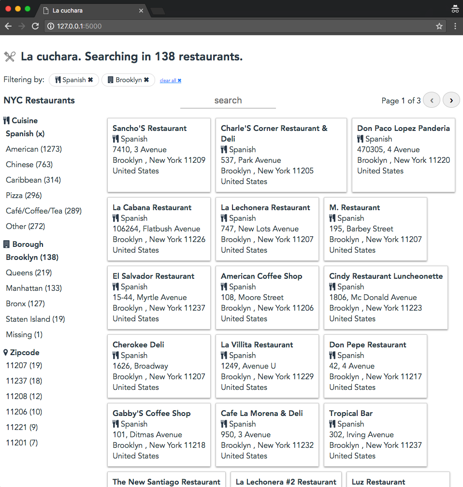

# Mongo facets

These are the specific steps to build this demo of faceted search navigation implemented with the stack: VueJS, Flask, MongoDB.



## Installing stuff
Everything assumes a MacOSX environment with [brew](https://brew.sh/), python, pip and [virtualenvwrapper](http://virtualenvwrapper.readthedocs.io/en/latest/index.html)

### Install mongo
```
$ brew install mongo
```

check if it works
```
$ mongo
MongoDB shell version v3.4.4
connecting to: mongodb://127.0.0.1:27017
MongoDB server version: 3.4.4
...
> show databases
> exit
```

### Load sample data (restaurants.json)

This is a sample collection of 25K restaurants of NYC from [mongo documentation](https://docs.mongodb.com/getting-started/shell/import-data/).

1. Download the dataset:

```
$ curl -O https://raw.githubusercontent.com/mongodb/docs-assets/primer-dataset/primer-dataset.json
```

2. Import the dataset in 'test' database:

```
$ mongoimport --db test --collection restaurants --drop --file primer-dataset.json
```

3. Check if it was imported well:

```
$ mongo
MongoDB shell version v3.4.4
connecting to: mongodb://127.0.0.1:27017
MongoDB server version: 3.4.4
...
> use test
> db.restaurants.findOne()
{
	"_id" : ObjectId("596286ff0b13d7ec5826380f"),
	"address" : {
		"building" : "1007",
...
> db.restaurants.find().count()
25359
> db.restaurants.find({borough: 'Bronx'}).count()
2338
```

4. Create index:

```
> db.restaurants.createIndex( { cuisine: -1, borough: -1, zipcode: -1 } )
> db.restaurants.createIndex( { name: "text" } )
> exit
```

5. Remove downloaded dataset:

```
$ rm primer-dataset.json
```

### Setup Python project

Clone this repository and inside the folder:

1. Make a virtualenv:

```
$ mkvirtualenv mongo-facets
```

2. Install Python dependencies (Flask and PyMongo):

```
$ pip install -r requirements.txt
```

## Run the Flask server
```
$ python server.py
```

And enjoy playing in the frontend at [http://127.0.0.1:5000/](http://127.0.0.1:5000/) ! :D